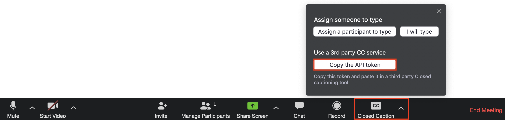
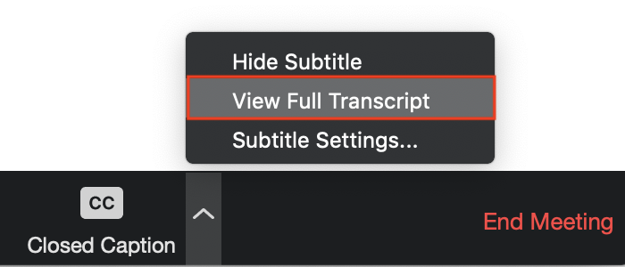

# Zoom Closed Captions

This is a simple Python script that uses speech recognition libraries to post [3rd-party closed captions for Zoom meetings](https://support.zoom.us/hc/en-us/articles/115002212983-Integrating-a-third-party-closed-captioning-service).

## Table of Contents

- [Usage](#usage)
- [Development](#development)
  - [Mac](#mac)
  - [Windows](#windows) - not tested
  - [Ubuntu](#ubuntu) - not tested
- [Other Useful Resources](#-other-useful-resources)

## Usage

Right now only Mac OSX is supported without following the [development](#development) installation instructions.

0. Download & unzip the latest release of zoom_cc.

1. Enable closed captioning in Zoom settings. Refer to [Zoom Help Center for instructions](https://support.zoom.us/hc/en-us/articles/207279736-Getting-started-with-closed-captioning).

2. Start a meeting and get the API token
 <!-- .element height="50%" width="50%" -->

3. Configure `zoom_cc_v0.1_OSX/settings.json` for your Zoom meeting
- `zoom_api_token` = Paste the copied API token. If left empty, you'll be prompted for the token at runtime
- `seq_count` = 0 for a new meeting, unless you are restarting the script during the same meeting you were already captioning. This increments with each caption so the Zoom API knows whether it received a new caption.
- `lang` = [Language option](https://cloud.google.com/speech-to-text/docs/languages) in post request (e.g. 'en-US' for English, 'zh' for Chinese)
- `mic_timeout` = Listening timeout for recognizer before resetting because nothing was said
- `phrase_time_limit` = Speaking timeout before transcribing and posting to Zoom (set lower to update Zoom more often, higher for more continuous phrases)

4. Start recognition script
- Open up Terminal
- Open up Finder to where `zoom_cc_0.1_OSX` is downloaded. Click and drag `zoom_cc_v0.1_OSX/dist/zoom_cc_v0.1_OSX` to the Terminal Window
- Press enter to run

5. When prompted, type `y` to load settings from `settings.config`. Otherwise paste API token and set sequence count via command line when prompted.

6. Check Zoom for transcriptions. Words should be appearing on the bottom of the screen and in the full transcript.
 <!-- .element height="50%" width="50%" -->

7. Use ctrl+C to exit. The `settings.json` will be updated with the last used token and sequence count in case the script needs to be restarted during a Zoom meeting.

## Development

### Mac
#### 1. Get [Hombrew](https://brew.sh/)

#### 2. Install [Python3](https://www.python.org/downloads/) & [PyAudio](http://people.csail.mit.edu/hubert/pyaudio/#downloads) prerequisites 
```sh
brew install python portaudio
```

#### 5. Get [PipEnv](https://pipenv-fork.readthedocs.io/en/latest/)
```sh
pip3 install pipenv
```

#### 6. Clone this git repo
```sh
git clone https://github.com/heyyeh12/zoom_cc.git
```

#### 7. Use PipEnv to install other dependencies
```sh
cd zoom_cc
pipenv install
```

#### 8. Run same [usage steps](#usage) as above, except start the Python script instead of executable in step 4
Using SpeechRecognizer Google Speech Recognition
```sh
pipenv run python speech_recognizer_closed_caption.py
```
(Experimental) Using Google Cloud Speech API. NOTE: requires setting up [GOOGLE_APPLICATION_CREDENTIALS](https://cloud.google.com/speech-to-text/docs/quickstart-client-libraries)
```sh
pipenv run python transcribe_streaming_infinite.py
```

#### 9. Create executable with [PyInstaller](http://www.pyinstaller.org/)
```sh
pipenv run pyinstaller --onefile speech_recognizer_closed_captions.py
```

### Windows - not tested

#### 1. Install [Python3](https://www.python.org/downloads/)

#### 2. Clone this git repo
```sh
git clone https://github.com/heyyeh12/zoom_cc.git
```
#### 3. Install [PyAudio](http://people.csail.mit.edu/hubert/pyaudio/#downloads) system-dependent prerequisites
```
python -m pip install pyaudio
```

#### 4. Get [PipEnv](https://pipenv-fork.readthedocs.io/en/latest/)
```sh
pip3 install pipenv
```

#### 5. Use PipEnv to install other dependencies
```sh
cd zoom_cc
pipenv install
```

### For Ubuntu - not tested

#### 1. Install [Python3](https://www.python.org/downloads/)

#### 2. Clone this git repo
```sh
git clone https://github.com/heyyeh12/zoom_cc.git
```
#### 3. Install [PyAudio](http://people.csail.mit.edu/hubert/pyaudio/#downloads) system-dependent prerequisites
```sh
sudo apt-get install python-pyaudio python3-pyaudio
```

#### 4. Get [PipEnv](https://pipenv-fork.readthedocs.io/en/latest/)
```sh
pip3 install pipenv
```

#### 5. Use PipEnv to install other dependencies
```sh
cd zoom_cc
pipenv install
```

## Other Useful Resources
- [SpeechRecognition Python module](https://github.com/Uberi/speech_recognition)
  - [microphone/recognizer settings](https://github.com/Uberi/speech_recognition/blob/master/reference/library-reference.rst)
- [Google Cloud Speech-to-Text API](https://cloud.google.com/speech-to-text/docs)